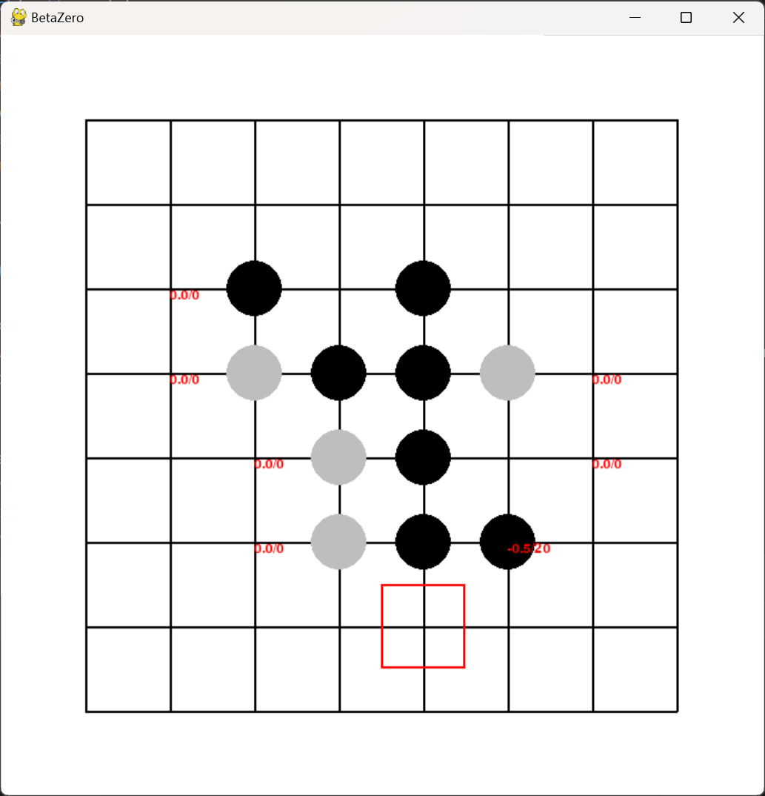

# Othello AI

Monte Carlo Tree Search for Othello (A simple implementation of AlphaZero)

### Completed

- Pure Monte Carlo Tree Search(C++, Python)

### To Do

- MCTS + CNN(Python)

## Start

### Python version

Run `python/main.py`



### C++ version

Sample output:

```
落子 H8
获胜概率: 60.7445%
平局概率: 5.90004%
搜索量: 3789
Select+Expand 用时: 0.328
Quick Move 用时: 0.62
     A  B  C  D  E  F  G  H
  1  _  _  o  _  x  _  _  _
  2  _  _  o  _  o  o  o  _
  3  o  x  o  _  o  o  x  x
  4  o  o  x  o  o  x  x  _
  5  o  _  o  x  o  _  x  _
  6  o  o  o  x  x  o  x  o
  7  _  _  o  _  x  _  o  _
  8  _  _  o  _  _  _  _  o
Hash: 307558021983527933
等待 player1 落子
```


